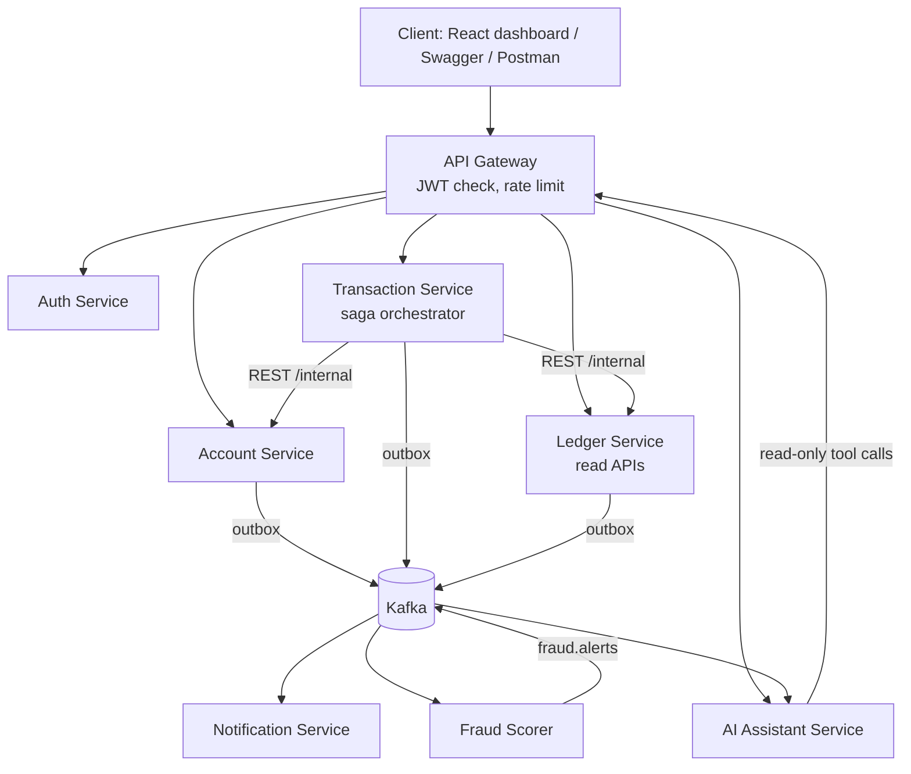
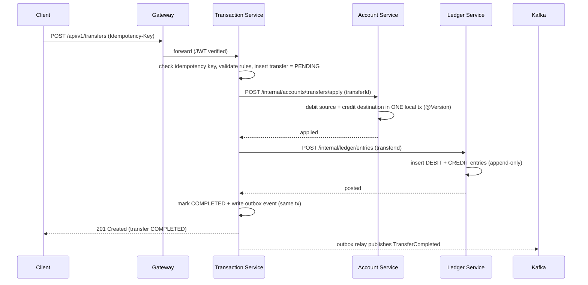

# Bankflow — Architecture & Project Brief

> **Audience:** AI coding agents and developers. Read this file fully before writing code, then read `CODING_STANDARDS.md`. If a task conflicts with either document, stop and ask rather than guessing.
>
> `Bankflow` is a placeholder name. The system is a **simulated** banking platform: no real money, no real bank integrations, no real customer data.

---

## 1. Purpose & Scope

Bankflow is a portfolio-grade **microservices banking platform** built with Java 21 and Spring Boot. It exists to demonstrate correct handling of the hard parts of backend engineering in finance:

- **Idempotent** money transfers (a retried request never moves money twice)
- A **double-entry ledger** that always balances and is append-only
- **Concurrency control** (no overdrafts or lost updates under parallel requests)
- A **saga with compensation** for multi-service transfers
- **Event-driven** processing with retries, dead-letter queues and idempotent consumers
- An **advisory AI layer** (fraud scoring + LLM spending assistant) that never touches money movement

### In scope
Customer registration/login, account management, transfers between accounts, deposits/withdrawals (simulated via a system cash account), transaction history/statements, notifications, fraud alerts for admin review, an AI spending assistant, reconciliation, observability, containerized deployment.

### Out of scope (do not build unless explicitly asked)
Real payment gateways or bank APIs, real KYC providers, cards, loans, interest calculation, multi-currency FX, mobile apps, regulatory reporting. A minimal Next.js dashboard is optional; Swagger UI and Postman collections are enough.

---

## 2. Non-Negotiable Invariants

Every change must preserve these. If a change could violate one, add a test proving it doesn't.

| # | Invariant |
|---|-----------|
| I1 | The same `Idempotency-Key` from the same user never creates more than one transfer. Same key + different payload → `409`. |
| I2 | For every transfer, ledger entries sum to zero (total debits = total credits). |
| I3 | `ledger_entries` rows are never updated or deleted. Corrections are new reversing entries. |
| I4 | An account balance never goes below zero (no overdraft feature). |
| I5 | Total money across all accounts (including the system cash account) is constant under any number of parallel transfers. |
| I6 | A transfer is never left half-applied: it ends `COMPLETED` or `FAILED` with compensation done. |
| I7 | AI components never initiate or reverse money movement. |
| I8 | No service reads another service's database. |
| I9 | Money is `BigDecimal` in Java and `NUMERIC(19,4)` in Postgres. |

---

## 3. Tech Stack

| Concern | Choice |
|---|---|
| Language / framework | Java 21, Spring Boot 3.x |
| API gateway | Spring Cloud Gateway |
| Security | Spring Security, JWT (access + refresh), BCrypt |
| Persistence | PostgreSQL 16 (one logical DB per service), Spring Data JPA, Flyway |
| Cache / idempotency / rate limit | Redis |
| Messaging | Apache Kafka |
| Resilience | Resilience4j (retry, circuit breaker, timeouts) |
| AI | Spring AI (LLM via Ollama locally or a hosted API); optional Python FastAPI for the fraud ML model |
| Testing | JUnit 5, Mockito, Testcontainers, MockMvc, k6 (load) |
| Observability | Actuator, Micrometer, Prometheus, Grafana, structured JSON logs |
| Build / delivery | Maven or Gradle, Docker, Docker Compose, GitHub Actions, AWS EC2 (or similar) |
| API docs | springdoc-openapi (Swagger UI) |

---

## 4. System Overview



Two communication styles:
- **Synchronous REST** for the transfer critical path (Transaction → Account → Ledger) and for user-facing reads.
- **Asynchronous Kafka events** for everything that *reacts* to a transfer (notifications, fraud scoring, AI summaries).

Each service owns its own database. Nothing else touches it (I8).

---

## 5. Services

### 5.1 API Gateway (`gateway`, port 8080)
- Single public entry point. Routes `/api/v1/**` to services. **Never** routes `/internal/**`.
- Validates JWT signature/expiry, rate-limits (Redis), generates `X-Correlation-Id` if missing, forwards the authenticated user id/roles to services.
- Contains no business logic.

### 5.2 Auth Service (`auth-service`, port 8081)
- **Responsibility:** registration, login, JWT issuance/refresh, roles (`CUSTOMER`, `ADMIN`), simulated KYC status.
- **DB:** `auth_db` — `users`, `roles`, `user_roles`, `refresh_tokens`.
- **Public endpoints:**
  - `POST /api/v1/auth/register`
  - `POST /api/v1/auth/login`
  - `POST /api/v1/auth/refresh`
  - `POST /api/v1/auth/logout`
  - `GET  /api/v1/users/me`
- **Publishes:** `UserRegistered` (→ `auth.events`).

### 5.3 Account Service (`account-service`, port 8082)
- **Responsibility:** accounts and their **cached balances**. Applies debits/credits atomically with optimistic locking. Owns account lifecycle (`ACTIVE`, `FROZEN`, `CLOSED`).
- **DB:** `account_db` — `accounts`, `outbox_events`, `audit_logs`.
- **Public endpoints:**
  - `POST /api/v1/accounts` — open an account
  - `GET  /api/v1/accounts` — list my accounts
  - `GET  /api/v1/accounts/{accountId}` — details and balance
  - `PATCH /api/v1/accounts/{accountId}/status` — admin: freeze/unfreeze/close
- **Internal endpoints (Transaction service only):**
  - `POST /internal/accounts/transfers/apply` — atomically debit source and credit destination for a `transferId` (idempotent by `transferId`)
  - `POST /internal/accounts/transfers/reverse` — compensation: undo a previously applied transfer (idempotent by `transferId`)
  - `GET  /internal/accounts/{accountId}` — validate existence, ownership, status
- **Publishes:** `AccountOpened`, `AccountStatusChanged`.

### 5.4 Transaction Service (`transaction-service`, port 8083)
- **Responsibility:** transfer/deposit/withdrawal APIs, **idempotency**, business-rule checks (limits), and the **saga orchestration** (Section 7).
- **DB:** `transaction_db` — `transfers`, `saga_steps`, `outbox_events`, `audit_logs`.
- **Redis:** fast idempotency lookup and short-lived locks (DB unique constraint is the source of truth).
- **Public endpoints:**
  - `POST /api/v1/transfers` — **requires `Idempotency-Key`**
  - `GET  /api/v1/transfers/{transferId}`
  - `GET  /api/v1/accounts/{accountId}/transfers` — paginated history
  - `POST /api/v1/deposits` and `POST /api/v1/withdrawals` — simulated, also idempotent (implemented as transfers to/from the system cash account)
- **Synchronous rules (plain code, not AI):** amount > 0, source ≠ destination, both accounts `ACTIVE`, sufficient balance, per-transaction and daily limits.
- **Publishes:** `TransferInitiated`, `TransferCompleted`, `TransferFailed` (→ `transaction.events`).

### 5.5 Ledger Service (`ledger-service`, port 8084)
- **Responsibility:** the **immutable double-entry ledger** — source of truth for money. Runs reconciliation.
- **DB:** `ledger_db` — `ledger_entries` (append-only), `reconciliation_runs`, `outbox_events`.
- **Internal endpoints:**
  - `POST /internal/ledger/entries` — post the debit+credit entries for a `transferId` (idempotent by `transferId`)
  - `POST /internal/ledger/entries/reverse` — post reversing entries for a failed/compensated transfer
- **Public endpoints (read-only):**
  - `GET /api/v1/accounts/{accountId}/statement?from=&to=&page=&size=`
  - `GET /api/v1/admin/reconciliation/latest` (admin)
- **Reconciliation job (scheduled):** for each account, recompute balance from ledger entries and compare to the Account service's cached balance (read via an internal endpoint or snapshot event). **Report drift; never auto-correct.**
- **Publishes:** `LedgerEntriesPosted` (→ `ledger.posted`), `ReconciliationDriftDetected`.

### 5.6 Notification Service (`notification-service`, port 8085)
- **Responsibility:** turn events into user notifications (email/SMS/in-app, simulated via logs or a fake SMTP like MailHog).
- **DB:** `notification_db` — `notifications`, `delivery_attempts`, `processed_events`.
- **Consumes:** `transaction.events`, `fraud.alerts`.
- **Behavior:** idempotent consumer, retry with exponential backoff, dead-letter to `<topic>.dlq`, per-user rate limiting, deduplication.

### 5.7 Fraud Scorer (`fraud-service`, port 8086) — *AI layer*
- **Responsibility:** score completed transfers asynchronously and raise alerts for **admin review only**.
- **DB:** `fraud_db` — `fraud_scores`, `fraud_alerts`, `processed_events`.
- **Consumes:** `ledger.posted` / `transaction.events`.
- **Scoring pipeline:**
  1. **Rules (v1):** amount far above the user's average, high velocity (many transfers in a short window), transfers to a new payee at unusual hours, repeated near-limit amounts.
  2. **ML (v2):** an anomaly model (e.g., Isolation Forest) trained on a **synthetic** dataset in-repo; model file versioned; `model_version` stored with each score.
- **Output:** a `fraud_scores` row for every transfer; a `fraud_alerts` row + `fraud.alerts` event when the score exceeds a threshold.
- **Admin endpoints:** `GET /api/v1/admin/fraud/alerts`, `PATCH /api/v1/admin/fraud/alerts/{alertId}` (mark reviewed/dismissed/confirmed).
- **Hard rule (I7):** it never freezes, blocks or reverses. An admin may freeze an account through the Account service as a separate audited action.

### 5.8 AI Assistant Service (`ai-assistant-service`, port 8087) — *AI layer*
- **Responsibility:** answer natural-language questions about the user's own spending ("How much did I spend on food last month?"), plus transaction categorization and monthly summaries.
- **Stack:** Spring AI with tool calling.
- **Tools available to the model (read-only, user-scoped):** `getAccountSummary`, `getTransactions(from,to,category)`, `getSpendingByCategory(month)`. Tools call existing read APIs with the user's token. The model **never** computes balances or totals; tools return the numbers, the model phrases them.
- **Endpoints:** `POST /api/v1/assistant/chat`, `GET /api/v1/assistant/summary/monthly`.
- **Categorization:** classifies transaction descriptions into categories with a confidence score; low-confidence items are flagged for user correction. Accuracy is measured on a labeled set.
- **DB:** `ai_db` — `ai_interactions` (redacted prompt, tool calls, response, model, latency), `transaction_categories`, `processed_events`.
- **Guardrails:** mask account numbers, no PII in prompts, timeouts, fallback message when the model is unavailable.

---

## 6. Data Model (summary)

All tables: `id UUID` PK, `created_at TIMESTAMPTZ`, and `updated_at TIMESTAMPTZ` where rows change. Full conventions in `CODING_STANDARDS.md`.

```
auth_db
  users(id, email UNIQUE, password_hash, full_name, status, kyc_status, created_at, updated_at)
  roles(id, name UNIQUE)
  user_roles(user_id, role_id)
  refresh_tokens(id, user_id, token_hash, expires_at, revoked_at, created_at)

account_db
  accounts(id, account_number UNIQUE, owner_id, type, currency, balance NUMERIC(19,4) CHECK >= 0,
           status, version BIGINT, created_at, updated_at)
  outbox_events(id, aggregate_type, aggregate_id, event_type, payload JSONB, created_at, published_at)
  audit_logs(id, actor, action, entity_type, entity_id, details JSONB, correlation_id, created_at)

transaction_db
  transfers(id, idempotency_key, request_hash, initiated_by, from_account_id, to_account_id,
            amount NUMERIC(19,4) CHECK > 0, currency, status, failure_reason,
            created_at, updated_at,
            UNIQUE(initiated_by, idempotency_key))
  saga_steps(id, transfer_id, step, status, attempt, error, created_at, updated_at)
  outbox_events(...)
  audit_logs(...)

ledger_db
  ledger_entries(id, transfer_id, account_id, direction CHECK IN ('DEBIT','CREDIT'),
                 amount NUMERIC(19,4) CHECK > 0, currency, entry_type CHECK IN ('TRANSFER','REVERSAL'),
                 created_at,
                 UNIQUE(transfer_id, account_id, direction, entry_type))     -- append-only
  reconciliation_runs(id, started_at, finished_at, accounts_checked, drift_count, details JSONB)
  outbox_events(...)

notification_db
  notifications(id, user_id, channel, template, status, created_at, updated_at)
  delivery_attempts(id, notification_id, attempt, status, error, created_at)
  processed_events(event_id PRIMARY KEY, processed_at)

fraud_db
  fraud_scores(id, transfer_id UNIQUE, score, decision, reasons JSONB, model_version, created_at)
  fraud_alerts(id, transfer_id, score, status, reviewed_by, reviewed_at, created_at, updated_at)
  processed_events(...)

ai_db
  ai_interactions(id, user_id, kind, redacted_prompt, tool_calls JSONB, response, model, latency_ms, created_at)
  transaction_categories(transfer_id, category, confidence, source, created_at)
  processed_events(...)
```

### System accounts
A `SYSTEM_CASH` account (owned by the system, type `SYSTEM`) is the counterparty for simulated deposits and withdrawals so that **every** movement is a balanced transfer. Its balance is allowed to go negative *only* because it represents cash outside the customer base; total system money (customers + system) stays constant (I5).

---

## 7. Core Flow: Transfer Saga (orchestrated)

The **Transaction service is the orchestrator**. It owns the transfer's state machine:

`PENDING → DEBITED (funds applied) → LEDGER_POSTED → COMPLETED`
with failure path `→ COMPENSATING → FAILED`.



### Step-by-step
1. **Receive & validate.** Require `Idempotency-Key`. Compute a hash of the request body.
   - Key exists, same hash → return the stored result.
   - Key exists, different hash → `409 IDEMPOTENCY_KEY_REUSED`.
   - Key new → continue.
2. **Business rules.** Amount, ownership of source account, both accounts `ACTIVE`, sufficient funds (advisory check), daily/per-transaction limits.
3. **Persist `PENDING`** transfer with the unique `(initiated_by, idempotency_key)` constraint. A concurrent duplicate loses the race on the constraint and returns the winner's result.
4. **Apply funds** via Account service (`apply`, idempotent by `transferId`). Uses `@Version` optimistic locking with bounded retry. Insufficient funds → transfer `FAILED`, no compensation needed.
5. **Post ledger entries** via Ledger service (idempotent by `transferId`).
6. **Complete.** Mark `COMPLETED` and write the `TransferCompleted` outbox row in the same DB transaction.
7. **Publish** via outbox relay → Kafka.

### Failure handling (compensation)
| Failure point | Action |
|---|---|
| Validation / insufficient funds at step 2 or 4 | Mark `FAILED` with reason; nothing to undo |
| Ledger post fails or times out at step 5 (after funds applied) | Retry with backoff (idempotent). If still failing → call Account `reverse`, mark `FAILED`, write `TransferFailed` |
| Transaction service crashes mid-saga | On restart, a **recovery job** scans `PENDING`/`DEBITED`/`COMPENSATING` transfers older than a threshold and resumes or compensates, using `saga_steps` |
| Response lost to the client | Client retries with the same `Idempotency-Key` and receives the final result |

All downstream calls carry the `transferId` so retries are safe. Compensation itself is idempotent.

---

## 8. Events (Kafka)

Envelope (all events): `eventId, eventType, eventVersion, occurredAt, correlationId, producer, payload`.

| Topic | Producer | Events | Consumers |
|---|---|---|---|
| `auth.events` | auth-service | `UserRegistered` | notification |
| `account.events` | account-service | `AccountOpened`, `AccountStatusChanged` | notification, ai-assistant |
| `transaction.events` | transaction-service | `TransferInitiated`, `TransferCompleted`, `TransferFailed` | notification, fraud, ai-assistant |
| `ledger.posted` | ledger-service | `LedgerEntriesPosted` | fraud, ai-assistant |
| `fraud.alerts` | fraud-service | `FraudAlertRaised` | notification |
| `<topic>.dlq` | consumers | poison messages after retries | admin tooling |

- Partition key: `accountId` (or `transferId` where needed).
- Producers use the **transactional outbox**. Consumers are **idempotent** (`processed_events`).
- Payloads carry IDs, amounts and statuses only — no secrets or full account numbers.

---

## 9. Security Model

- **Authentication:** JWT access token (short-lived, e.g., 15 min) + refresh token (rotating, stored hashed). Passwords hashed with BCrypt.
- **Authorization:** roles `CUSTOMER` and `ADMIN`. Customers may only access their own accounts/transfers (ownership check in the service layer, not just the gateway).
- **Defense in depth:** gateway validates JWT; each service validates it again. `/internal/**` endpoints are reachable only on the internal Docker network and require a service credential/mTLS-style shared secret.
- **Rate limiting:** login and transfer endpoints at the gateway (Redis-backed).
- **Secrets:** environment variables only; `.env.example` documents names.
- **Logging:** structured, correlation-id tagged, sensitive values masked.
- **AI:** models receive minimized, masked data; tools are read-only and user-scoped; all interactions are logged.

---

## 10. Repository Layout

```
bankflow/
├── ARCHITECTURE.md
├── CODING_STANDARDS.md
├── docker-compose.yml
├── .env.example
├── .github/workflows/
├── bankflow-common/            # event envelope, error model, correlation-id filter
├── gateway/
├── auth-service/
├── account-service/
├── transaction-service/
├── ledger-service/
├── notification-service/
├── fraud-service/
├── ai-assistant-service/
├── frontend/                   # optional
├── load-tests/                 # k6
└── docs/                       # diagrams, ADRs
```

## 11. Local Development

`docker compose up` starts:

| Component | Port |
|---|---|
| gateway | 8080 |
| auth / account / transaction / ledger | 8081 / 8082 / 8083 / 8084 |
| notification / fraud / ai-assistant | 8085 / 8086 / 8087 |
| PostgreSQL (one instance, one DB per service for dev) | 5432 |
| Kafka | 9092 |
| Redis | 6379 |
| Prometheus / Grafana | 9090 / 3000 |
| MailHog (fake SMTP, optional) | 8025 |
| Ollama (local LLM, optional) | 11434 |

Each service must also run standalone against Testcontainers for tests. Seed data is **synthetic**.

---

## 12. Testing Strategy

| Level | What |
|---|---|
| Unit | Service methods with Mockito; every failure path |
| Integration | Testcontainers (Postgres, Kafka, Redis); repository and messaging tests |
| Concurrency | 100 parallel transfers → total money constant, no negative balances (I4, I5) |
| Idempotency | Repeated and parallel identical requests → exactly one transfer (I1) |
| Ledger invariant | Sum of debits = sum of credits per transfer (I2) |
| Saga failure injection | Force failure at each step; assert consistent end state (I6) |
| Load | k6 script: N concurrent transfers, record throughput and p95 latency |
| AI evaluation | Categorization accuracy; fraud precision/recall on a held-out synthetic set; added latency |

---

## 13. Observability

- Structured JSON logs with `correlationId`, `service`, `transferId`.
- Metrics: request rate/latency/errors per service, Kafka consumer lag, saga failure count, DLQ depth, reconciliation drift count, AI call latency.
- Grafana dashboards + alert rules for DLQ growth, saga failures and drift.
- `X-Correlation-Id` flows through HTTP calls **and** Kafka event envelopes so one transfer can be traced across services.

---

## 14. Build Phases

1. **Foundation:** monorepo, Docker Compose, gateway, Auth service (JWT), common library, CI skeleton.
2. **Core money path:** Account service, Transaction service with idempotency + optimistic locking + validation.
3. **Ledger & saga:** Ledger service, orchestrated saga with compensation, recovery job, reconciliation.
4. **Events:** outbox relay, Kafka topics, Notification service (retries, DLQ), Testcontainers suite, concurrency tests.
5. **AI layer:** Fraud scorer (rules → ML) and AI assistant with tool calling; evaluation metrics.
6. **Hardening:** k6 load test, Prometheus/Grafana, deployment, README with diagrams, demo video.

Build the core banking flow **before** any AI feature. AI work starts only when phases 1–4 are green.

---

## 15. Rules for AI Coding Agents

**Do**
- Read this file and `CODING_STANDARDS.md` before making changes; re-check the invariants (Section 2) for anything touching money.
- Keep controllers thin; put logic in services; use DTOs/records; use `BigDecimal` for money.
- Add a Flyway migration for every schema change; name constraints explicitly.
- Write tests with the change, including failure paths and (for money paths) concurrency/idempotency.
- Use the outbox for events and idempotent consumers.
- Update this document when the design changes, and note deviations as short ADRs in `docs/`.
- Ask when a requirement is ambiguous instead of inventing behavior.

**Do not**
- Let any AI/ML component initiate, block or reverse money movement.
- Read or write another service's database, or share JPA entities across services.
- Use `double`/`float` for money, or mutate/delete ledger rows.
- Call other services or publish to Kafka inside a DB transaction (use the outbox).
- Log secrets, tokens, full account numbers or PII; commit secrets.
- Add dependencies without the checks listed in `CODING_STANDARDS.md`.
- Introduce real payment gateways, real customer data, or features listed as out of scope.
- Rewrite unrelated code or "improve" architecture beyond the requested task.

---

## 16. Glossary

- **Idempotency key:** client-generated unique id sent with a money-moving request; guarantees at-most-once effect.
- **Double-entry ledger:** every transfer records equal debit and credit entries; the books always balance.
- **Saga:** a multi-step business transaction across services with compensating actions for failures.
- **Compensation:** an action that semantically undoes an earlier step (e.g., reversing a debit).
- **Outbox pattern:** write the event to a DB table in the same transaction as the state change; a relay publishes it, avoiding lost or phantom events.
- **DLQ:** dead-letter queue for messages that fail after retries.
- **Reconciliation:** comparing the ledger's computed balances against cached account balances to detect drift.
- **Optimistic locking:** version-column checks that reject conflicting concurrent updates instead of blocking.
