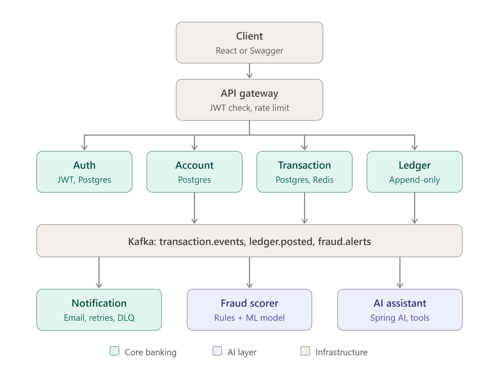
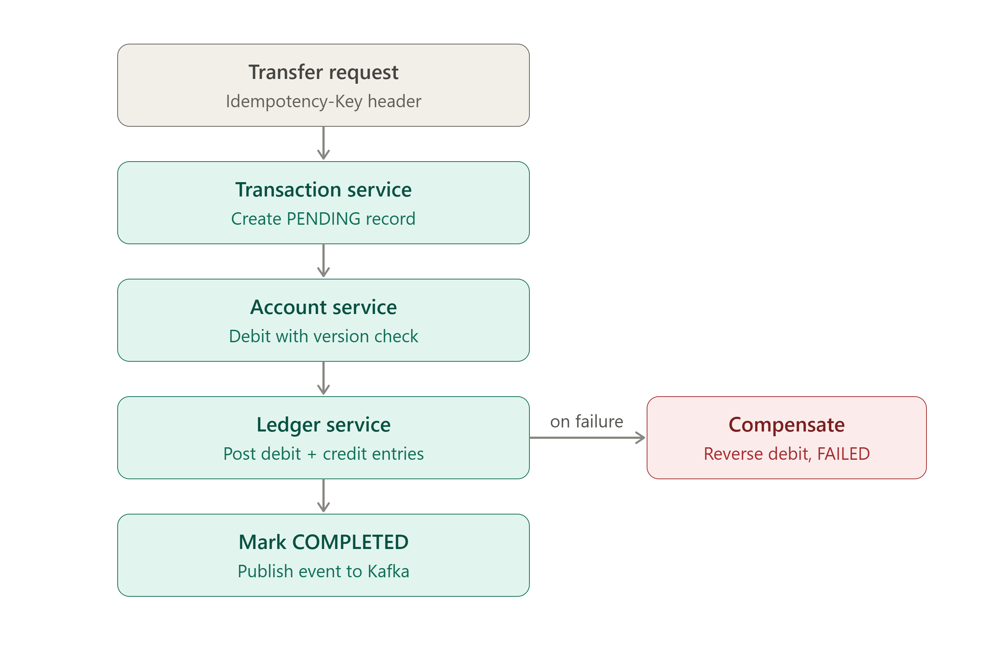

# FinCore — Bankflow

> A **portfolio-grade microservices banking platform** built with Java 21 and Spring Boot 3.x, demonstrating correct handling of the hard parts of backend engineering in finance: idempotent money transfers, double-entry ledger, saga compensation, event-driven processing, fraud detection, and an AI spending assistant.

---

## System Architecture



---

## Non-Negotiable Invariants

| # | Invariant |
|---|-----------|
| I1 | The same `Idempotency-Key` from the same user **never** creates more than one transfer. Same key + different payload → `409`. |
| I2 | For every transfer, ledger entries sum to zero (total debits = total credits). |
| I3 | `ledger_entries` rows are **never** updated or deleted. Corrections are new reversing entries. |
| I4 | An account balance **never** goes below zero (no overdraft). |
| I5 | Total money across all accounts is constant under any number of parallel transfers. |
| I6 | A transfer is never left half-applied — it ends `COMPLETED` or `FAILED` with compensation done. |
| I7 | AI components **never** initiate or reverse money movement. |
| I8 | No service reads another service's database. |
| I9 | Money is `BigDecimal` in Java and `NUMERIC(19,4)` in Postgres. |

---

## Tech Stack

| Concern | Choice |
|---|---|
| Language / Framework | Java 21, Spring Boot 3.x |
| API Gateway | Spring Cloud Gateway |
| Security | Spring Security, JWT (access + refresh), BCrypt |
| Persistence | PostgreSQL 16, Spring Data JPA, Flyway |
| Cache / Rate Limiting | Redis |
| Messaging | Apache Kafka (Transactional Outbox Pattern) |
| Inter-Service Calls | Spring Cloud OpenFeign |
| Resilience | Resilience4j (retry, circuit breaker, timeouts) |
| AI | Spring AI (LLM via Ollama) |
| Testing | JUnit 5, Mockito, Testcontainers |
| Observability | Actuator, Micrometer, Prometheus, Grafana |
| Build / Delivery | Maven, Docker, Docker Compose, GitHub Actions |

---

## Services

| Service | Port | Responsibility | Status |
|---|---|---|---|
| `gateway` | 8080 | Single entry point — JWT validation, rate limiting, routing | ✅ Live |
| `auth-service` | 8081 | Registration, login, JWT issuance/refresh, roles | ✅ Live |
| `account-service` | 8082 | Account lifecycle, balance management, optimistic locking | ✅ Live |
| `transaction-service` | 8083 | Transfer saga orchestration, idempotency, business rules | ✅ Live |
| `ledger-service` | 8084 | Immutable double-entry ledger, reconciliation | 🔧 Phase 3 |
| `notification-service` | 8085 | Email/in-app notifications via Kafka events | 🔧 Phase 4 |
| `fraud-service` | 8086 | Async fraud scoring (rules → ML), admin alerts | 🔧 Phase 5 |
| `ai-assistant-service` | 8087 | LLM spending assistant, transaction categorisation | 🔧 Phase 5 |

---

## Transfer Saga (Core Money Flow)



Every transfer request **requires** an `Idempotency-Key` header. The system guarantees exactly-once money movement regardless of retries, network failures, or crashes.

---

## Infrastructure Ports

| Component | Port |
|---|---|
| PostgreSQL | 5432 |
| Apache Kafka | 9092 |
| Redis | 6379 |
| Kafka UI | 8090 |
| MailHog (fake SMTP) | 8025 |
| Prometheus | 9090 |
| Grafana | 3000 |

---

## Local Development

### Prerequisites
- Docker Desktop

### 1. Create your `.env` file
```bash
cp .env.example .env
# Edit .env and set JWT_SECRET and other secrets
```

### 2. Start all services
```bash
docker compose up -d
```

### 3. Verify everything is healthy
```bash
docker compose ps
```

### 4. Test the Auth endpoints via API Gateway
```bash
# Register a new user
POST http://localhost:8080/api/v1/auth/register
Content-Type: application/json
{
  "email": "test@example.com",
  "password": "Password123!",
  "fullName": "John Doe"
}

# Login
POST http://localhost:8080/api/v1/auth/login
Content-Type: application/json
{
  "email": "test@example.com",
  "password": "Password123!"
}

# Get your profile (use the accessToken from login)
GET http://localhost:8080/api/v1/users/me
Authorization: Bearer <accessToken>
```

### 5. Test Account endpoints (Phase 2)
```bash
# Open a new account (type: SAVINGS or CHECKING)
POST http://localhost:8080/api/v1/accounts
Authorization: Bearer <accessToken>
Content-Type: application/json
{
  "type": "SAVINGS",
  "currency": "USD"
}

# List all accounts for the authenticated user
GET http://localhost:8080/api/v1/accounts
Authorization: Bearer <accessToken>

# Get a specific account
GET http://localhost:8080/api/v1/accounts/<accountId>
Authorization: Bearer <accessToken>
```

### 6. Test Transfer endpoints (Phase 2)
```bash
# Initiate a transfer (Idempotency-Key header is REQUIRED — generate a UUID)
POST http://localhost:8080/api/v1/transfers
Authorization: Bearer <accessToken>
Idempotency-Key: <your-unique-uuid>
Content-Type: application/json
{
  "fromAccountId": "<sourceAccountId>",
  "toAccountId": "<destinationAccountId>",
  "amount": 100.00,
  "currency": "USD"
}

# Get a transfer by ID
GET http://localhost:8080/api/v1/transfers/<transferId>
Authorization: Bearer <accessToken>
```

> **Idempotency Behaviour:**
> - Same `Idempotency-Key` + same body → returns cached result (safe retry, no double-charge)
> - Same `Idempotency-Key` + different body → `409 IDEMPOTENCY_KEY_REUSED`
> - New `Idempotency-Key` → treated as a brand new transfer

### 7. Useful dashboards
| Dashboard | URL |
|---|---|
| Kafka UI | http://localhost:8090 |
| Grafana | http://localhost:3000 (admin/admin) |
| MailHog | http://localhost:8025 |
| Prometheus | http://localhost:9090 |

### Teardown
```bash
# Stop all containers and remove volumes
docker compose down -v
```

---

## Memory Optimization (Local Development)

All Spring Boot services are configured with JVM memory limits via `JAVA_TOOL_OPTIONS: "-Xms128m -Xmx256m"` in `docker-compose.yml`. This caps each service to 256 MB RAM, preventing Docker Desktop from running out of memory when all 8 services are running simultaneously. This setting is transparent for local development workloads and should be removed or increased in production.

---

## Build Phases

- [x] **Phase 1 — Foundation:** Monorepo, Docker Compose, API Gateway, Auth Service (JWT), Common Library, CI skeleton
- [x] **Phase 2 — Core Money Path:** Account Service, Transaction Service (idempotency + optimistic locking)
- [ ] **Phase 3 — Ledger & Saga:** Ledger Service, orchestrated saga with compensation, recovery job, reconciliation
- [ ] **Phase 4 — Events:** Outbox relay, Kafka consumers, Notification Service, Testcontainers suite, concurrency tests
- [ ] **Phase 5 — AI Layer:** Fraud scorer (rules → ML) and AI Assistant with tool calling
- [ ] **Phase 6 — Hardening:** k6 load tests, Prometheus/Grafana dashboards, deployment, full documentation

---

## Repository Layout

```
FinCore/
├── ARCHITECTURE.md             # Full system design and decisions
├── CODING_STANDARDS.md         # Mandatory coding conventions for all agents
├── docker-compose.yml
├── .env.example
├── .github/workflows/          # CI pipeline
├── bankflow-common/            # Shared: event envelope, error model, correlation filter
├── gateway/
├── auth-service/
├── account-service/            # Phase 2 ✅
├── transaction-service/        # Phase 2 ✅
├── ledger-service/             # Phase 3
├── notification-service/       # Phase 4
├── fraud-service/              # Phase 5
├── ai-assistant-service/       # Phase 5
└── scripts/
    └── init-databases.sql      # Creates all Postgres databases on first boot
```

---

## Key Design Decisions

- **Transactional Outbox Pattern** — Events are written to the database in the same transaction as the state change, then relayed to Kafka asynchronously. This eliminates dual-write failures.
- **Optimistic Locking** — Account balances use a `@Version` column so that concurrent transfers fail fast on conflict (and retry) rather than blocking.
- **OpenFeign for synchronous calls** — All internal service-to-service HTTP calls use Spring Cloud OpenFeign with Resilience4j retry and circuit breaker. `RestTemplate` and `RestClient` are forbidden.
- **Idempotency via DB constraint** — The `UNIQUE(initiated_by, idempotency_key)` DB constraint is the source of truth. The hash of the request body (`SHA-256`) detects same-key/different-payload abuse.
- **Defense-in-depth JWT validation** — The Gateway validates the JWT first and forwards `X-User-Id`/`X-User-Roles` headers. Each downstream service also validates the JWT independently to reject any forged internal requests.
- **Internal service security** — Endpoints under `/internal/**` are blocked at the Gateway level and additionally protected by an `X-Internal-Secret` header verified in each service's `InternalSecretFilter`.
- **`noRollbackFor` on failed transfers** — The `@Transactional` on `TransferService.createTransfer` uses `noRollbackFor = TransferExecutionException.class` so that a `FAILED` transfer record and its idempotency key are always committed to the database, even when an exception is thrown.